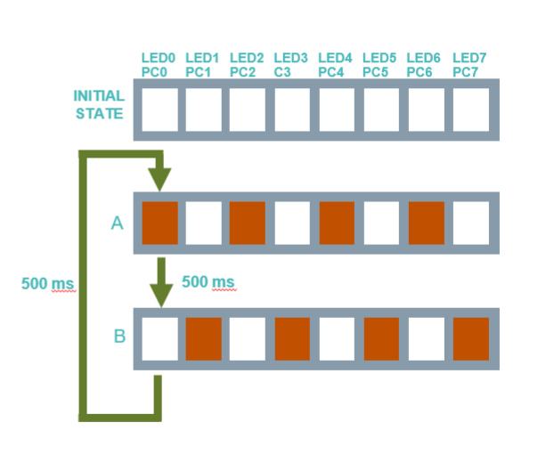
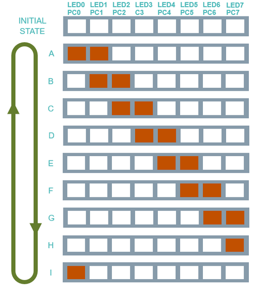

# Homework 1

## Ecercise 1

**Bitwise manipulation**
**Requirement: perform the alternate blink of odd and even LEDs:**

Cycle this infinitely.

The time between sequences is 500 milliseconds.

## Exercise 2

**Bitwise manipulation**
**Requirement: turn on the first two LEDs of the bargraph and then "move" them right LED by LED**

Cycle this infinitely.

The time between each "move" is 500 milliseconds.

Extra: At the end shift them in opposite direction.

